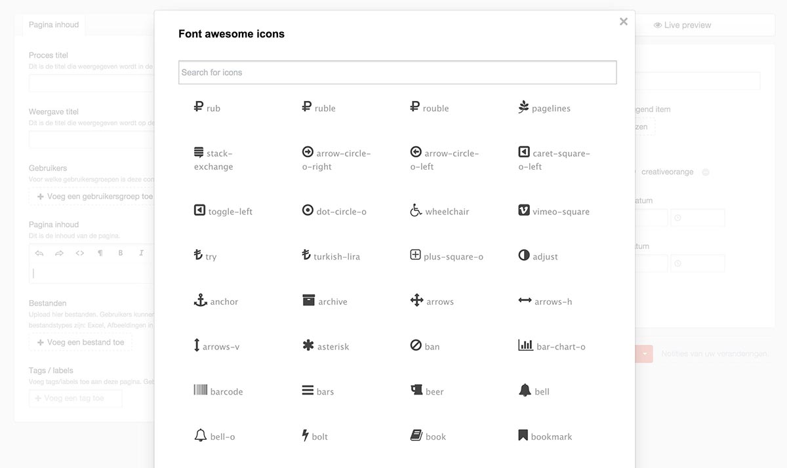

**LOOKING FOR THE CRAFT 2.x VERSION?** [Download here](https://github.com/creativeorange/Craft-redactor-font-awesome/archive/1.1.zip)


# Craft - Redactor Font Awesome plugin - Craft 3



This plugin adds the ability to select Font Awesome icons in Redactor in your CP panel. To use this plugin you also need the free [Redactor](https://github.com/craftcms/redactor) plugin. 

## Download & Installation

While Craft 3 is still in beta, you'll need to use Composer to download and install the plugin.

1. Open your terminal and go to your Craft project:

```
cd /path/to/project
```

2. Then tell Composer to load the plugin:

```
composer require svenjungnickel/redactor-font-awesome
```

3. Include the Font Awesome plugin in your Redactor config file located in `craft/config/redactor/-your-config-file-.json`. To do so, add `fontAwesome` in the plugins array.

4. In the Control Panel, go to Settings → Plugins and click the “Install” button for Redactor Font Awesome.

**NOTE:** Don't forget to include font awesome on your front-end. 


## Changelog

2015-12-02: Added support for Craft 2.5 and no longer supports < 2.5 - If you need support for Craft < 2.5 please download the release 1.0

2017-11-21: Added support for Craft 3. Craft 2.5 is is no longer supported. If you need support for Craft 2 please download the latest version from [creativeorange](https://github.com/creativeorange/Craft-redactor-font-awesome)

## Version
2.0
